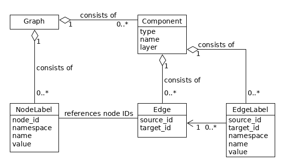

# Representing annotations as graph

## Elements of the graph

The following figure gives an overview of the elements of the graphANNIS model, which is based on a directed graph (see Cormen et al. 2009, p. 1168 [^cormen]).

GraphANNIS does not partition the data documents like it was done in relANNIS, graphANNIS partitions the corpora into 

- information about the nodes and node labels, and
- edges and edge label information which are partitioned again into components.

In this model, each node is internally identified by a unique ID.
Node labels consist of a namespace, a name, and a value and are connected to a node by its ID.
No explicit representation of nodes exists: If a node exists there must be at least one label for this node.
There is a special label named `annis::node_name`[^qname]} that can be applied to any node to mark its existence.

GraphANNIS has the concept of components for edges.
A component has a type, a name, and a layer. 
It consists of edges and edge labels.
Edges between two nodes are uniquely defined inside a component with the source and target node ID.
There can not be more than one edge between the same two nodes inside the same component.
Each edge can have multiple edge labels.
In addition to the source and target node ID, edge labels also have namespaces, names and values.
For one edge, only one edge label having the same namespace and name can exist.
Graphs are the aggregation of node labels and edge components.

## Token

## Spans

## Hierarchies

## References

## Corpus structure

[^cormen]: T. H. Cormen, C. E. Leiserson, R. L. Rivest, und C. Stein, Introduction to Algorithms, 3. Aufl. The MIT Press, 2009.

[^qname]: This is a fully qualified representation of the label name which includes the reserved namespace `annis`.